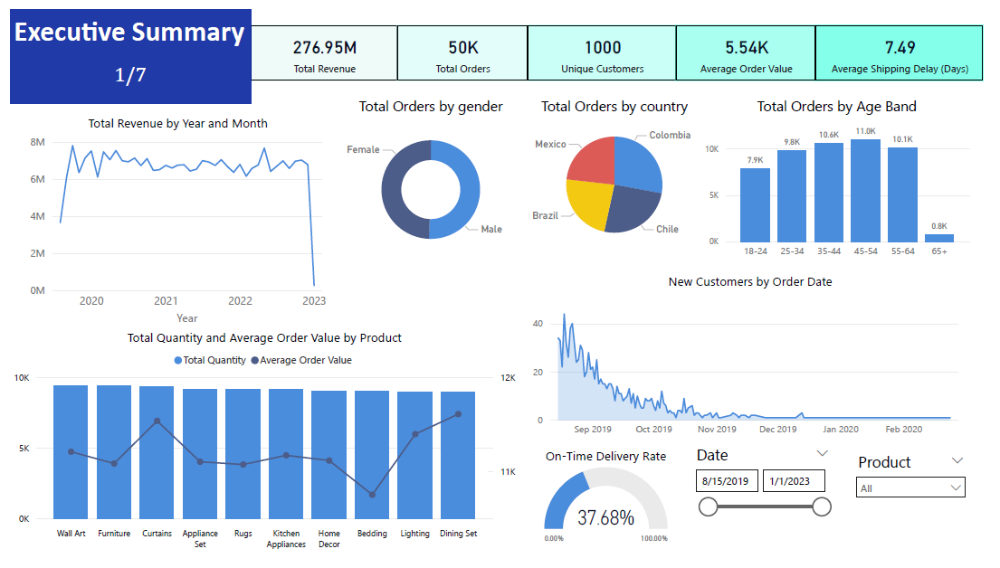

# 🛒 E-Commerce Performance Dashboard

  
*Interactive Power BI dashboard analyzing sales, customers, and operations.*

---

**Files:**
- `ecommerce_dashboard.pbix` — Interactive Power BI dashboard  
- `ecommerce_presentation.pdf` — Presentation deck summarizing insights  

## 📘 Overview
This dashboard explores **customer behavior, product performance, and operational efficiency** in an e-commerce business environment.

## 🔍 Objectives
- Understand sales trends and customer segmentation  
- Evaluate performance across regions and product categories  
- Identify operational bottlenecks and shipping inefficiencies  

## 💡 Key Insights
- 💰 **Top 20% of customers** generate ~80% of total revenue  
- ⚠️ **Average delivery delay:** ~7.5 days — increases operational costs  
- 🏷️ **Discount-heavy months** reduce profit margins despite higher sales  
- 🌍 **Regional revenue gaps** highlight untapped market opportunities  

## 🧠 Tools & Techniques
- **Power BI:** DAX measures, calculated columns, KPI cards, and data segmentation  
- **Analysis Areas:** Customer value, loyalty, regional and product performance  
- **Visualization Design:** Seven interactive pages covering executive overview, customer demographics, value segmentation, operations, and strategy  

---

## 📦 Dataset
- **Filenames:** `customer.csv`, `purchase.csv`  
- **Location:** Same folder as this dashboard  
- **Source:** Provided as part of the *Data Science and AI Professional Certificate Course* (Xaltius Academy)  
- **License:** Educational use only  
- ⚠️ *Note:* The dataset is **not publicly redistributed** due to course material restrictions.  
  Please use your copy of the dataset from the course materials.

---

## 🧑‍💻 Author
**Bryan Kim Bauyon**  
- [LinkedIn](https://www.linkedin.com/in/bryan-kim-bauyon/)  
- [GitHub](https://github.com/BryanBauyon)  
- [DataCamp Portfolio](https://www.datacamp.com/portfolio/bkmbauyon)

