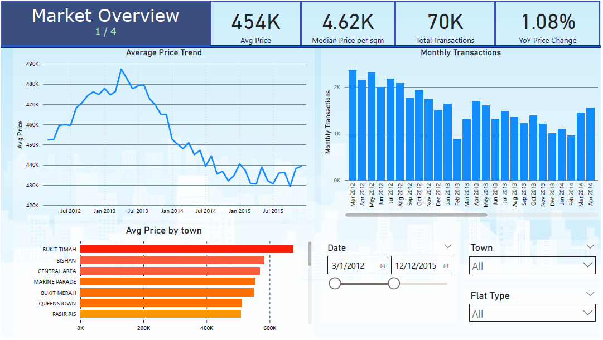

# 🏠 Real Estate Market Analysis Dashboard

  
*Interactive Power BI dashboard analyzing property trends and affordability.*

---

**Files:**
- `real_estate_dashboard.pbix` — Interactive Power BI dashboard  
- `real_estate_presentation.pdf` — Presentation deck summarizing findings  

## 📘 Overview
Analyzes **HDB resale transactions (2012–2023)** to uncover **pricing trends, affordability patterns, and benchmark insights** within Singapore’s housing market.

## 🔍 Objectives
- Visualize real estate trends and market movements  
- Compare property pricing efficiency across towns and flat types  
- Provide benchmarking tools for valuation and decision-making  

## 💡 Key Insights
- 📈 Property prices show steady long-term growth with cyclical volumes  
- 🕒 Lease years remaining critically affect property valuation  
- 🌆 Central towns command premium prices; outer towns offer affordability  
- 🧭 Benchmarking reveals undervalued vs. overvalued locations  

## 🧠 Tools & Techniques
- **Power BI:** DAX measures, trend & benchmark analysis, KPI visualizations  
- **Data Source:** HDB Resale Transactions (2012–2023)  
- **KPIs:** Average Price, Median Price/sqm, Transaction Counts, YoY Price Change  

---

## 📦 Dataset
- **Filename:** `hdb_resale_flats.csv`  
- **Location:** Same folder as this dashboard  
- **Source:** Provided as part of the *Data Science and AI Professional Certificate Course* (Xaltius Academy)  
- **License:** Educational use only  
- ⚠️ *Note:* The dataset is **not publicly redistributed** due to course material restrictions.  
  Please use your copy of the dataset from the course materials.

---

## 🧑‍💻 Author
**Bryan Kim Bauyon**  
- [LinkedIn](https://www.linkedin.com/in/bryan-kim-bauyon/)  
- [GitHub](https://github.com/BryanBauyon)  
- [DataCamp Portfolio](https://www.datacamp.com/portfolio/bkmbauyon)

